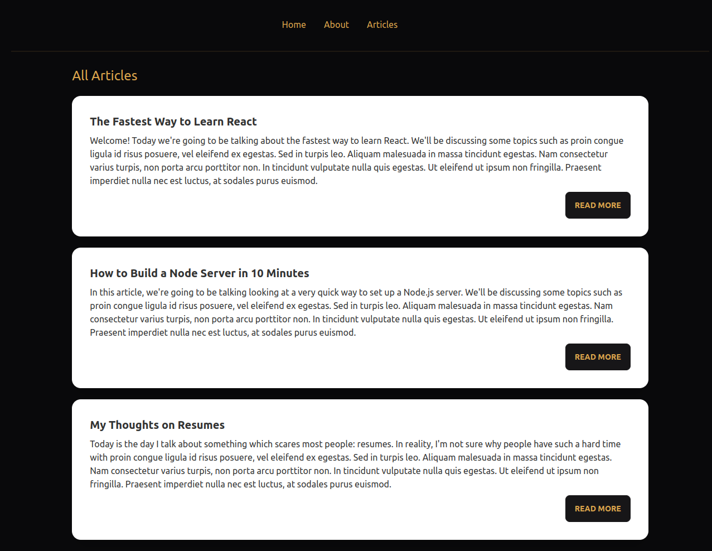

<h3 align="center">Blogry</h3>

<div align="center">

[](https://github.com/rawda-developer/Blogry/)
[](https://github.com/rawda-developer/Blogry/issues)
[](https://github.com/rawda-developer/Blogry/pulls)

</div>

---

<p align="center"> This project is a blogging website built using the MERN Stack and Tailwindcss. It has 4 pages to display home, about, and a list of articles. For styling purposes, I used daisyUI which is a component library for Tailwind css.
    <br> 
   
</p>



## 📝 Table of Contents

- [About](#about)
- [Getting Started](#getting_started)
- [Usage](#usage)
- [Built Using](#built_using)

- [Authors](#authors)

## 🧐 About <a name = "about"></a>

Use this project as a guideline for buiding MERN Stack projects using Tailwindcss and daisyUI

## 🏁 Getting Started <a name = "getting_started"></a>

These instructions will get you a copy of the project up and running on your local machine for development and testing purposes.

### Prerequisites

What things you need to install the software and how to install them.

```
node -v
npm -v
```

### Installing

A step by step series of examples that tell you how to get a development env running.

```
git clone https://github.com/rawda-developer/Blogry
```

```
cd Blogry
```

```
cd frontend
npm install
npm start
```

## ⛏️ Built Using <a name = "built_using"></a>

- [MongoDB](https://www.mongodb.com/) - Database
- [Express](https://expressjs.com/) - Server Framework
- [React.js](https://create-react-app.dev/) - Web Framework
- [NodeJs](https://nodejs.org/en/) - Server Environment

## ✍️ Authors <a name = "authors"></a>

- [@RawdaDeveloper](https://github.com/rawda-developer) - Idea & Initial work
